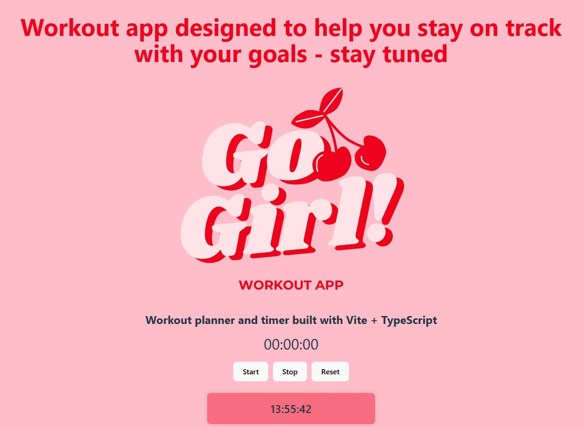

# Welcome to Go Girl Workout App! 🚀

A simple and effective tool to help you plan, track, and stay consistent with your workouts. Designed for both coaches and individual users, this app allows easy customization of workout routines, including exercise repetitions, sets, and time tracking.

## 📌 Planned features

- ✅ Customizable Workout Plans – Your coach can create a personalized training plan tailored to your sport goals.
- ✅ Adjustable Repetitions & Sets – Modify your exercises based on your progress.
- ✅ Built-in Time Counter – Stay on track with an automatic timer for exercises and breaks.
- ✅ User-Friendly Interface – Just open the app and get moving!
- ✅ Responsive Design – Use it anytime, anywhere, on desktop, tablet, or mobile.

## 📌 Roadmap

- 🔹 Phase 1: Basic workout creation & tracking
- 🔹 Phase 2: Progress tracking & analytics
- 🔹 Phase 3: Social sharing & coach feedback
